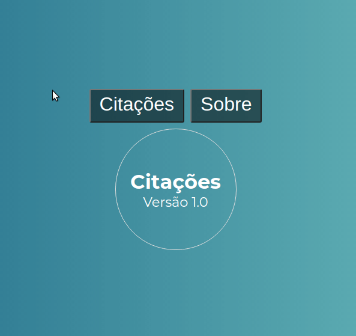

# citacoes

An application for demonstrating motivational phrases

## Main features
### Citacoes


### Prerequisites

* [GIT](https://git-scm.com/)
* [NPM](https://www.npmjs.com/)  
OR
* [YARN](https://yarnpkg.com/)

## Getting Started
### Clone the repository
```
git clone https://github.com/EmersonBraun/citacoes.git
```

### Install the dependencies
```
npm install
```
Or
```
yarn
```

### Compiles and hot-reloads for development
```
npm run serve
```
Or
```
yarn serve
```

## Built With

* [Vue](https://vuejs.org/) - The Progressive JavaScript Framework.

## Authors

* **Emerson Braun** - *Initial work* - [EmersonBraun](https://github.com/EmersonBraun)

## License

This project is licensed under the MIT License - see the [LICENSE.md](LICENSE.md) file for details

